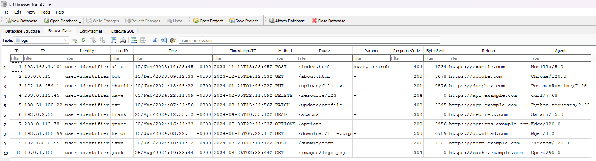

# xilt

A utility for parsing Common and Combined Log Format (CLF) log files and storing them in SQLite for further analysis. Built with concurrency in mind.

## Usage

### Install

`go get go.vxn.dev/xilt/cmd/xilt@latest`

### Run

`xilt [logFilePath] [dbFilePath]`

- Default `logFilePath` = `./access.log`
- Default `dbFilePath` = `./logs.db`

### Flags

```text
$ xilt -h
Usage of xilt:
  -avgLogSize float
        Defines the average size of one log in MB. Used for calculating the number of goroutines to spin up. (default 0.001)
  -batchSize int
        Defines the batch size. Used for calculating the number of goroutines to spin up. (default 5000)
  -i    Defines whether indexes should be created in the parsed logs' table.
  -maxMemUsage int
        Defines the maximum allowed memory usage in Megabytes. Used for calculating the number of goroutines to spin up. (default 100)
  -v    Defines whether verbose mode should be used.
```

### Indexes

Currently, if the `-i` flag is used, the following indexes are created:

- IP
- Method
- Referer
- Route
- TimestampUTC
- TimestampUTC + IP

This may be subject to change in the future depending on further fine-tuning and configurable parameters extension.

## Example

`logs.txt`:

```text
192.168.1.101 user-identifier alice [12/Nov/2023:14:23:45 -0400] "POST /index.html?query=search HTTP/1.1" 404 1234 "https://example.com" "Mozilla/5.0"
10.0.0.15 user-identifier bob [15/Dec/2023:09:12:33 -0500] "GET /about.html HTTP/1.0" 200 5678 "https://google.com" "Chrome/120.0"
172.16.254.1 user-identifier charlie [20/Jan/2024:18:45:22 -0700] "PUT /upload/file.txt HTTP/1.1" 201 9876 "https://dropbox.com" "PostmanRuntime/7.26"
203.0.113.45 user-identifier dave [05/Feb/2024:22:11:09 +0000] "DELETE /resource/123 HTTP/1.1" 204 0 "https://api.example.com" "curl/7.68"
198.51.100.22 user-identifier eve [10/Mar/2024:07:34:56 -0800] "PATCH /update/profile HTTP/1.1" 400 2345 "https://app.example.com" "Python-requests/2.25"
192.0.2.33 user-identifier frank [25/Apr/2024:12:55:12 +0200] "HEAD /status HTTP/1.0" 302 0 "https://redirect.com" "Safari/15.0"
203.0.113.78 user-identifier grace [30/May/2024:16:44:33 -0600] "OPTIONS /options HTTP/1.1" 200 3456 "https://options.example.com" "Edge/120.0"
198.51.100.99 user-identifier heidi [15/Jun/2024:03:22:11 -0300] "GET /download/file.zip HTTP/1.1" 500 6789 "https://download.com" "Wget/1.21"
192.168.0.55 user-identifier ivan [20/Jul/2024:10:11:12 -0400] "POST /submit/form HTTP/1.1" 201 4321 "https://form.example.com" "Firefox/120.0"
10.0.1.100 user-identifier jack [25/Aug/2024:19:33:44 -0700] "GET /images/logo.png HTTP/1.0" 304 0 "https://cache.example.com" "Opera/90.0"
```

Run `xilt -i logs.txt logs.db`:

```text
$ xilt -i logs.txt logs.db
2025/03/11 22:38:44 beginning reading from log file and the parsing process...
2025/03/11 22:38:44 creating table indexes...
2025/03/11 22:38:44 table indexes created...
2025/03/11 22:38:44 log parsing finished
2025/03/11 22:38:44 elapsed time: 624.7111ms
```

The resulting `logs.db` file:


## Benchmark

Currently, a basic benchmark is available:

A large log file containing 17 379 453 logs (~1.63 GB in size) takes 1 minute, 55 seconds on average to be parsed and stored in SQLite if not using indexes. Index creation on a table of such size prolongs the duration to ~4 minutes.

All logs in the file are the same: `127.0.0.1 user-identifier frank [10/Oct/2000:13:55:36 -0700] "GET /apache_pb.gif HTTP/1.0" 200 2326`.

Without indexes:

```text
$ xilt logs benchmark.db
2025/03/11 22:47:18 beginning reading from log file and the parsing process...
2025/03/11 22:49:12 log parsing finished
2025/03/11 22:49:12 elapsed time: 1m54.7359703s
```

With indexes:

```text
$ xilt -i logs benchmark.db
2025/03/11 22:54:47 beginning reading from log file and the parsing process...
2025/03/11 22:56:38 creating table indexes...
2025/03/11 22:58:46 table indexes created...
2025/03/11 22:58:46 log parsing finished
2025/03/11 22:58:46 elapsed time: 3m59.774765s
```

### Memory Usage

Using the default presets (`batchSize=5000`, `avgLogSize=0.001`, `maxMemUsage=100`) to parse the aforementioned benchmark file leads to an average RAM usage of ~85 MB.

## Build & Run Locally

- `git clone https://github.com/thevxn/xilt`
- `go build ./cmd/xilt`
- `./xilt`

## TODO

- Add support for JSON logs
- Add parsing of single params & create columns for each unique param found
- Fine-tune max. memory usage parameter
- Improve test coverage
